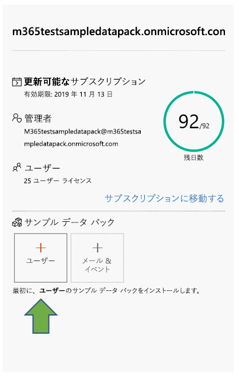
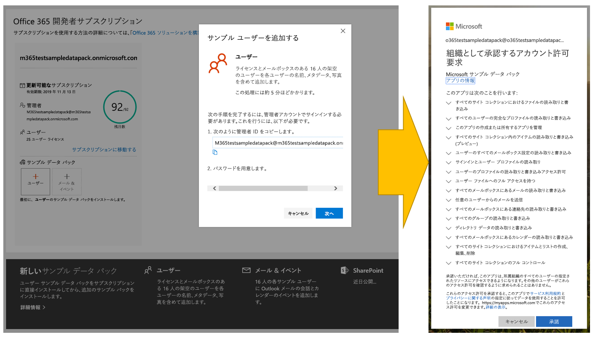
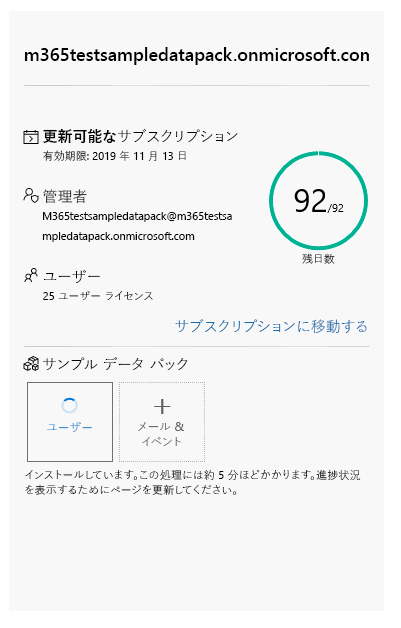
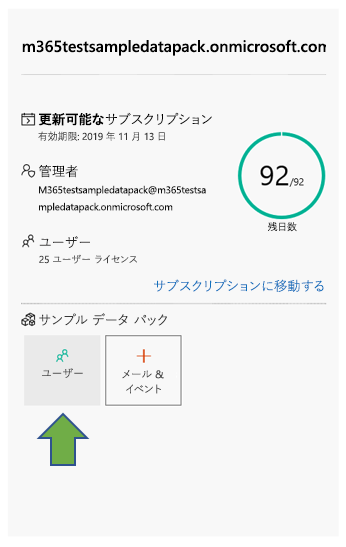
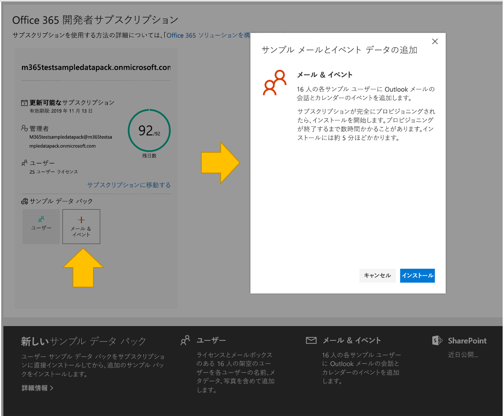

# Office 365 開発者サブスクリプションでサンプル データ パックを使用する

Office 365 開発者サブスクリプションにサンプル データ パックをインストールすることができます。 サンプル データ パックは、ソリューションの構築とテストに必要なデータとコンテンツを自動的にインストールするため、時間を節約することができます。 これには、小規模の企業環境をシミュレートするための架空のユーザー、メタデータ、および写真が含まれます。 サンプル データをすばやくインストールできるため、サンプル データを自分で作成することに時間を費やすことなく、ソリューションに集中することができます。

サンプル データ パックは、Office 365 サブスクリプション タイルの下部にある [Office 365 開発者プログラム ダッシュボード](https://developer.microsoft.com/office/profile)にあります。

現在、次のサンプル データ パックをご利用になれます。

- ユーザー - 各ユーザーの名前および写真を含むライセンスとメールボックスのある 16 人の架空のユーザーをインストールします。 Microsoft Graph API を使用して、次の方法でユーザー サンプル データを操作します。
  - 特定のユーザーの詳細を取得する
  - ユーザーを更新する
  - 直属の部下を取得する
  - 組織図を準備する  
  - 部署別にユーザーを取得する

- メールとイベント - 各 16 人のサンプル ユーザーに Outlook メールの会話とカレンダーのイベントを追加します。 Microsoft Graph API を使用して、次の方法でメールとイベント サンプル データを操作します。
  - ユーザーがメールを取得する
  - 日付でフィルター処理されたメールを取得する
  - 今後のイベントを取得する
  - 今後のイベントを更新/削除する

> [!NOTE]
> メールとイベントをインストールする前に、ユーザー サンプル データ パックをインストールする必要があります。

## サンプル データ パックは、Office 365 サブスクリプションに何を追加しますか?

ユーザー サンプル データ パックは、サブスクリプションに 16 人の架空のユーザーを作成します。各ユーザーのライセンスと、各ユーザーのメールボックス、名前、メタデータ、写真が含まれます。

メールとイベントのサンプル データ パックによって、インストールされた各 16 人のユーザーに Outlook メールの会話とカレンダーのイベントが追加されます。

## ユーザー サンプル データ パックをインストールする方法

ユーザー サンプル データ パックをインストールする前に、Office 365 開発者サブスクリプションを取得していて、管理者として自分にライセンスを割り当てていることを確認します。

> [!NOTE]
> サブスクリプションで 16 人のユーザーが利用できることを確認します。 サブスクリプションには、25 人のユーザーが含まれます。 既に 10 人以上で構成されている場合は、最初に複数のユーザーを削除してインストールが成功したことを確認します。

ユーザー サンプル データ パックをインストールするには、次の操作を行います。

1. サブスクリプション タイルの下部にある [**ユーザー**] ボックスを選択します。
2. 管理者 ID をコピーします。サブスクリプションにサインインする際に、アカウントが必要です。
3. サインイン ページで、管理者 ID とパスワードを入力します。
4. Office 365 開発者サブスクリプションの管理者としての権限に同意します。

5. すべてのサンプル ユーザーのパスワードを設定します。 すべての架空のユーザーを簡単に管理できるように、1 つの共有パスワードを定義する必要があります。

6. データがインストールされます。 インストールには約 5 分ほどかかります。

7. インストールが完了すると、メールで通知され、サブスクリプション タイルのボックスは緑色になります。 メールとイベントのサンプル データ パックをインストールできるようになりました。

## メールとイベントのサンプル データ パックをインストールする方法

ユーザー サンプル データ パックをインストールした後、メールとイベントをインストールすることができます。

1. サブスクリプション タイルの [**メール &amp; イベント**] ボックスを選択します。
2. [**インストール**] を選択して、インストールを開始します。

> [!NOTE]
> サブスクリプションを作成したばかりの場合は、インストールを開始する前にそのサブスクリプションを完全にプロビジョニングする必要があります。 これには数時間かかる場合があります。 インストールが開始された後、終了には最大 20 分かかります。

3. インストールが完了すると、メールで通知され、サブスクリプション タイルのボックスは緑色になります。

## サンプル データ パックは追加されますか?

はい。 SharePoint と OneDrive のサンプル データ パックを追加する予定です。 将来、Office アドイン、Microsoft Teams など、その他の製品とテクノロジのサンプル データ パックを追加することを検討しています。

## サンプル データ パックを他の Office 365 サブスクリプションにインストールできますか?

いいえ。 これらのサンプル データ パックは、Office 365 開発者プログラムの一部として取得した Office 365 開発者サブスクリプションとのみ互換性があります。

## サンプル データをサブスクリプションに表示するにはどのようにすればよいですか?

ユーザーのサンプル データ パックのインストール後に、追加されたユーザーを表示するには、Office 365 開発者サブスクリプションの**Microsoft 365 管理センター**に移動します。 [**ユーザー**] の下で [**アクティブなユーザー**] を選択します。 16 人のユーザーの一覧が表示されます。 ユーザーを選択すると、写真やライセンスを含む関連付けられたメタデータを表示できます。

メールとイベントのサンプル パックのインストール後にサンプル データを表示するには、**Microsoft 365 管理センター**で [**すべて表示**] を選択して、[**Exchange**] を選択します。 Exchange 管理センターで [**受信者**] を選択すると、16 人のユーザーそれぞれがメールボックスを持ち、メールやイベントが追加されていることを確認できます。

## 関連項目

- [Office 365 開発者サブスクリプションのセットアップ](office-365-developer-program-get-started.md)
