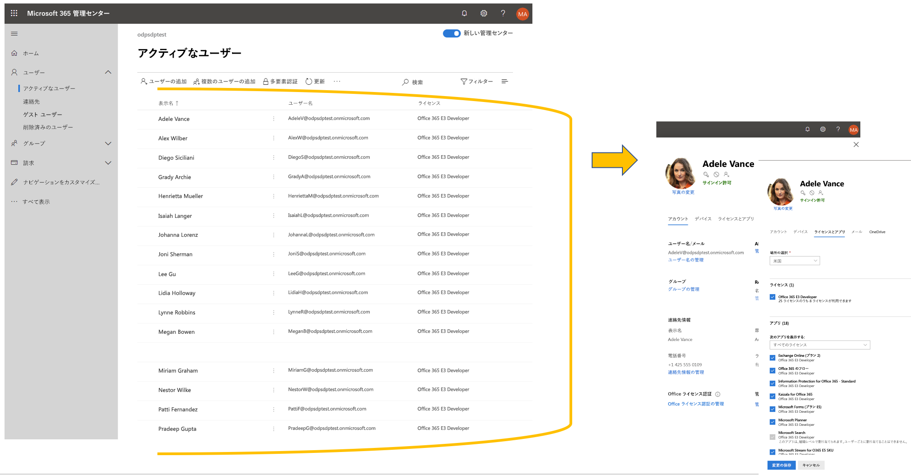
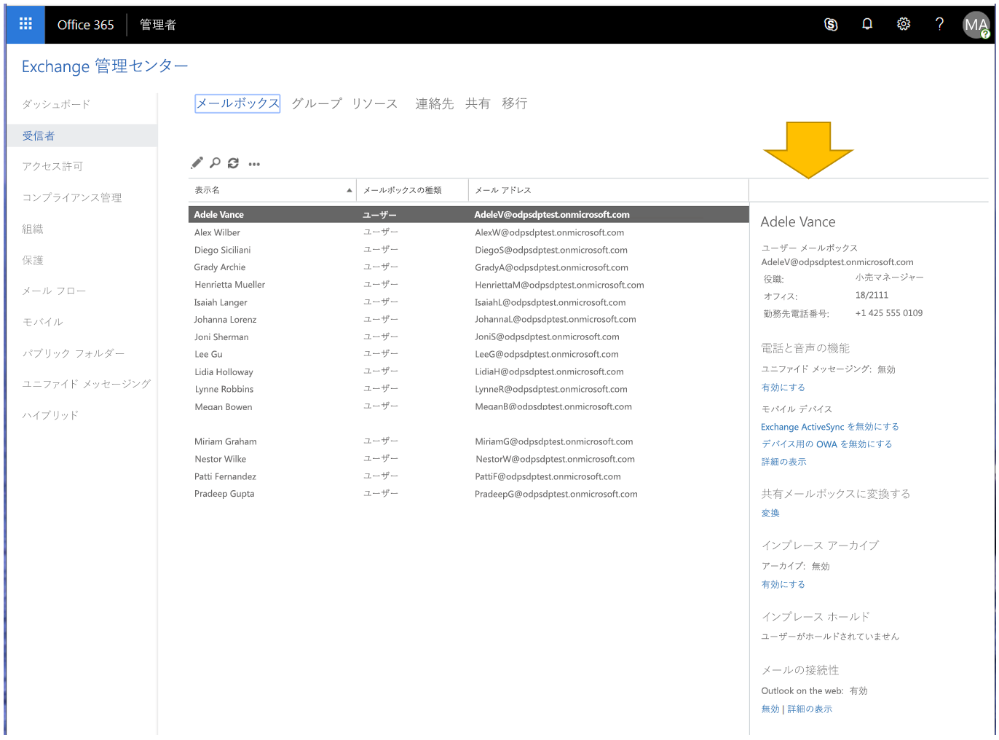

# Office 365 開発者サブスクリプションでサンプル データ パックを使用するUse sample data packs with your Office 365 developer subscription

Office 365 開発者サブスクリプションにサンプル データ パックをインストールすることができます。You can install sample data packs on your Office 365 developer subscription. サンプル データ パックは、ソリューションの構築とテストに必要なデータとコンテンツを自動的にインストールするため、時間を節約することができます。Sample data packs save you time by automatically installing data and content you need to build and test your solutions. これには、小規模の企業環境をシミュレートするための架空のユーザー、メタデータ、および写真が含まれます。This includes fictitious users, metadata, and photos to simulate a small corporate environment. サンプル データをすばやくインストールできるため、サンプル データを自分で作成することに時間を費やすことなく、ソリューションに集中することができます。You can quickly install the sample data so that you can focus on your solutions rather than spend time creating sample data yourself.

サンプル データ パックは、Office 365 サブスクリプション タイルの下部にある [Office 365 開発者プログラム ダッシュボード](https://developer.microsoft.com/office/profile)にあります。You can find sample data packs on your [Office 365 Developer Program dashboard](https://developer.microsoft.com/office/profile), at the bottom of your Office 365 subscription tile.

現在、次のサンプル データ パックをご利用になれます。The following sample data packs are currently available:

- ユーザー - 各ユーザーの名前および写真を含むライセンスとメールボックスのある 16 人の架空のユーザーをインストールします。Users - Installs 16 fictitious users with licenses, mailboxes, and metadata, including names and photos for each user. Microsoft Graph API を使用して、次の方法でユーザー サンプル データを操作します。Use Microsoft Graph APIs to work with user sample data in the following ways:
  - 特定のユーザーの詳細を取得するGet specific user details
  - ユーザーを更新するUpdate user
  - 直属の部下を取得するGet user's direct reports.
  - 組織図を準備するPrepare organization chart  
  - 部署別にユーザーを取得するGet users by department

- メールとイベント - 各 16 人のサンプル ユーザーに Outlook メールの会話とカレンダーのイベントを追加します。Mail and events - Adds Outlook email conversations and calendar events for each of the 16 sample users. Microsoft Graph API を使用して、次の方法でメールとイベント サンプル データを操作します。Use Microsoft Graph APIs to work with mail and events sample data in the following ways:
  - ユーザーがメールを取得するGet emails by users
  - 日付でフィルター処理されたメールを取得するGet emails filtered by date
  - 今後のイベントを取得するGet upcoming events
  - 今後のイベントを更新/削除するUpdate/delete upcoming events

> [!NOTE]
> メールとイベントをインストールする前に、ユーザー サンプル データ パックをインストールする必要があります。You must install the Users sample data pack before you install Mail and Events.

## サンプル データ パックは、Office 365 サブスクリプションに何を追加しますか?What do the sample data packs add to my Office 365 subscription?

ユーザー サンプル データ パックは、サブスクリプションに 16 人の架空のユーザーを作成します。各ユーザーのライセンスと、各ユーザーのメールボックス、名前、メタデータ、写真が含まれます。The Users sample data pack creates 16 fictitious users on your subscription, and includes the licenses for each user, and mailboxes, names, metadata, and photos for each.

メールとイベントのサンプル データ パックによって、インストールされた各 16 人のユーザーに Outlook メールの会話とカレンダーのイベントが追加されます。The Mail and Events sample data pack adds Outlook email conversations and calendar events for each of the 16 users installed.

## ユーザー サンプル データ パックをインストールする方法How do I install the Users sample data pack?

ユーザー サンプル データ パックをインストールする前に、Office 365 開発者サブスクリプションをお持ちで、管理者として自分にライセンスを割り当てる必要があります。Before you install the Users sample data pack, make sure that you have an Office 365 developer subscription and that you assign a license to yourself as the admin.

ユーザー サンプル データ パックをインストールするには、次の操作を行います。To install the Users sample data pack:

1. サブスクリプション タイルの下部にある [**ユーザー**] ボックスを選択します。Select the **Users** box at the bottom of your subscription tile.
2. 管理者 ID をコピーします。サブスクリプションにサインインする際に、アカウントが必要です。Copy your administrator ID; you will need it to sign in to your subscription.
3. サインイン ページで、管理者 ID とパスワードを入力します。Enter your administrator ID and password on the sign in page.
4. Office 365 開発者サブスクリプションの管理者としての権限に同意します。Consent to the permissions as an administrator of your Office 365 developer subscription.

5. すべてのサンプル ユーザーのパスワードを設定します。Configure your passwords for all sample users. すべての架空のユーザーを簡単に管理できるように、1 つの共有パスワードを定義する必要があります。You will need to have one shared password defined for easy administration of all your fictitious users.

6. データがインストールされます。The existing data will be overwritten. インストールには約 5 分ほどかかります。The installation should take about 5 minutes.

7. インストールが完了すると、メールで通知され、サブスクリプション タイルのボックスは緑色になります。When installation is finished, you'll be notified by email, and the box on your subscription tile will be green. メールとイベントのサンプル データ パックをインストールできるようになりました。You can now install the Mail and Events sample data pack.

## メールとイベントのサンプル データ パックをインストールする方法How do I install the Mail and Events sample data pack?

ユーザー サンプル データ パックをインストールした後、メールとイベントをインストールすることができます。After you've installed the Users sample data pack, you can install mail and events.

1. サブスクリプション タイルの [**メール &amp; イベント**] ボックスを選択します。Choose the **Mail &amp; Events** box on your subscription tile.
2. [**インストール**] を選択して、インストールを開始します。Click **Install** to begin the installation.

> [!NOTE]
> サブスクリプションを作成したばかりの場合は、インストールを開始する前にそのサブスクリプションを完全にプロビジョニングする必要があります。If you just created your subscription, it must be fully provisioned before installation can begin. これには数時間かかる場合があります。This can take up to a few hours. インストールが開始された後、終了には最大 20 分かかります。After installation starts, it can take up to 20 minutes to finish.

3. インストールが完了すると、メールで通知され、サブスクリプション タイルのボックスは緑色になります。When installation is finished, you'll be notified by email, and the box on your subscription tile will be green.

## サンプル データ パックは追加されますか?Are more sample data packs coming?

はい。Yes. SharePoint と OneDrive のサンプル データ パックを追加する予定です。We will add sample data packs for SharePoint and OneDrive. 将来、Office アドイン、Microsoft Teams など、その他の製品とテクノロジのサンプル データ パックを追加することを検討しています。In the future, we will consider adding sample data packs for more products and technologies, including Office Add-ins, Microsoft Teams, and more.

## サンプル データ パックを他の Office 365 サブスクリプションにインストールできますか?Can I install sample data packs on my other Office 365 subscriptions?

いいえ。No. これらのサンプル データ パックは、Office 365 開発者プログラムの一部として取得した Office 365 開発者サブスクリプションとのみ互換性があります。These sample data packs are only compatible with the Office 365 Developer Subscription you get as part of the Office 365 Developer Program.

## どうすればサンプル データをサブスクリプションに表示できますか?How can I see the sample data in my subscription?

ユーザーのサンプル データ パックのインストール後に、追加されたユーザーを表示するには、Office 365 開発者サブスクリプションで**Microsoft 365 管理センター**に移動します。After you install the Users sample data pack, to see the users that were added, go to the **Microsoft 365 Admin Center** on your Office 365 developer subscription. [**ユーザー**] の下で [**アクティブ ユーザー**] を選択します。Under **Users**, select **Active users**. 16 人のユーザーの一覧が表示されます。You will see the list of 16 users. ユーザーを選択して、写真やライセンスを含む関連付けられたメタデータを表示します。You can select a user to view the associated metadata, including photos and licenses.

メールとイベントのサンプル パックのインストール後に、サンプル データを表示するには、**Microsoft 365 管理センター**で [**すべて表示**] を選択して、[**Exchange**] を選択します。After you install the Mail and Events sample pack, to see the sample data, in the **Microsoft 365 Admin Center**, choose **Show all** and then select **Exchange**. Exchange 管理センターで [**受信者**] を選択すると、各 16 人のユーザーが、追加されたメールとイベントを含むメールボックスと共に表示されます。In the Exchange admin center, when you select **recipients**, you can see that each of the 16 users has mailboxes with mail and events added.

## 関連項目See also

- [Office 365 開発者サブスクリプションのセットアップSet up an Office 365 developer subscription](office-365-developer-program-get-started.md)
