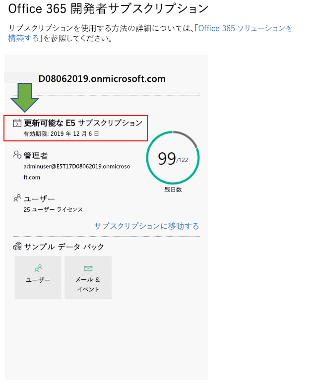

# Office 365 Developer Program FAQOffice 365 Developer Program FAQ

以下は、Office 365 Developer Program についてよく寄せられる質問です。The following are frequently asked questions about the Office 365 Developer Program.

## Office 365 Developer Program とは何ですか、対象者は誰ですか?What is the Office 365 Developer Program and who should join it?

Office 365開発者プログラムは、Office 365を拡張する、ユーザー中心のクロスプラットフォームの生産性向上エクスペリエンスを構築するのに役立つように設計されています。The Office 365 Developer Program is designed to help you build people-centric, cross-platform productivity experiences that extend Office 365. Office 365 製品とテクノロジの最適なソリューションを構築するのに必要なツール、ドキュメント、トレーニング、専門家、および コミュニティイベントにアクセスするプログラムに参加します。以下をカバーしています：Join our program to get access to the tools, documentation, training, experts, and community events that you need to build great solutions for Office 365 products and technologies, including:

- [Excel](https://developer.microsoft.com/excel)、[Outlook](https://developer.microsoft.com/outlook)、[Word](https://developer.microsoft.com/word)、そして[PowerPoint](https://developer.microsoft.com/powerpoint) web add-ins[Excel](https://developer.microsoft.com/excel), [Outlook](https://developer.microsoft.com/outlook), [Word](https://developer.microsoft.com/word), and [PowerPoint](https://developer.microsoft.com/powerpoint) web add-ins
- [SharePointSharePoint](https://developer.microsoft.com/sharepoint)
- [Microsoft TeamsMicrosoft Teams](https://developer.microsoft.com/microsoft-teams)
- [Microsoft GraphMicrosoft Graph](https://developer.microsoft.com/graph)

プログラムのメンバーは、Office 365開発者サブスクリプションと25ユーザー ライセンスを無料で得られ、ソリューション作成に役立てることができます。As a program member, you can get a free Office 365 developer subscription with 25 user licenses to use to build your solutions. このサブスクリプションは、ソリューションを積極的に開発および展開している限り、引き続き有効です。This subscription will remain active for as long as you’re actively developing and deploying solutions.

詳しくは、[Office 365 Developer Program に参加する](office-365-developer-program.md)と[Office 365ソリューションを構築する](build-office-365-solutions.md)をご覧ください。For more information, see [Join the Office 365 Developer Program](office-365-developer-program.md) and [Build Office 365 solutions](build-office-365-solutions.md).

## Office 365開発者プログラムにサインアップするには、どのアカウントを使用できますか?What account can I use to sign up for the Office 365 Developer Program?

次のいずれかの種類のアカウントを使用して、開発者プログラムにサインアップできます。You can sign up for the developer program by using one of the following account types:

- **Microsoft アカウント** (個人用に作成されたもの) - Outlook (Hotmail)、Messenger、OneDrive、MSN、Xbox Live、Office 365 など、すべてのコンシューマー向け Microsoft 製品とクラウド サービスにアクセスできます。**Microsoft account** (created by you for personal use) - Provides access to all consumer-oriented Microsoft products and cloud services, such as Outlook (Hotmail), Messenger, OneDrive, MSN, Xbox Live, or Office 365. Outlook.com メールボックスにサインアップすると、Microsoft アカウントが自動的に作成されます。Signing up for an Outlook.com mailbox automatically creates a Microsoft account. 作成された Microsoft アカウントを使用して、コンシューマー関連の Microsoft クラウド サービスまたは Azure にアクセスできます。After a Microsoft account is created, it can be used to access consumer-related Microsoft cloud services or Azure. 
- **職場のアカウント** (業務用に管理者が発行したもの) - Azure、Microsoft Intune、Office 365 など、小規模、中規模、エンタープライズ企業レベルの Microsoft クラウド サービスにアクセスできます。**Work account** (issued by an admin for business use) - Provides access to all small, medium, and enterprise business-level Microsoft cloud services, such as Azure, Microsoft Intune, or Office 365. 組織としてこのいずれかのサービスにサインアップすると、組織を表すクラウド ベースのディレクトリが Azure Active Directory に自動的にプロビジョニングされます。When you sign up to one of these services as an organization, a cloud-based directory is automatically provisioned in Azure Active Directory to represent your organization. 詳しくは、[Azure AD ディレクトリの管理](https://docs.microsoft.com/azure/active-directory/active-directory-administer)を参照してください。For more information, see [Manage your Azure AD directory](https://docs.microsoft.com/azure/active-directory/active-directory-administer).
- **Visual Studio ID** (Visual Studio Professional またはEnterprise サブスクリプションの作成) - このオプションを使用して、Visual Studio サブスクライバーとしての完全なメリットを活用できる Visual Studio ギャラリー内から開発者プログラムに参加することをお勧めします。**Visual Studio ID** (created for your Visual Studio Professional or Enterprise subscriptions) - We recommend that you use this option to join the developer program from within the Visual Studio Gallery to get the full benefits as a Visual Studio subscriber. 

## 開発者プログラムを通して Office 365 開発者向けサブスクリプションを取得する方法を教えてくださいHow can I get an Office 365 developer subscription via the Developer Program?  

Office 365 開発者プログラムに参加すると、Office 365 開発者向けサブスクリプションを無料で取得できます。If you join the Office 365 Developer Program, you qualify to get a free Office 365 developer subscription. これは、アプリケーション開発目的での使用のみが想定された、特別なサブスクリプションです。This is a special subscription designed to be used for application development only, and comes with 25 user licenses. 詳細については、「[Office 365 開発者向けサブスクリプションをセットアップする](office-365-developer-program-get-started.md)」を参照してください。For more information, see [Set up an Office 365 developer subscription](office-365-developer-program-get-started.md).

## 開発者プログラム ダッシュボードにサインインする際はどの ID を使用すればよいですか?What ID do I use to sign in to the Developer Program dashboard?

開発者プログラムのダッシュボードにサインインしてサブスクリプションに関する情報にアクセスするには、メンバー ID を使用します。Use your member ID to sign in to the Developer Program dashboard to access information about your subscription. これは、プログラムに登録したときにサインインするのに使用した、Microsoft アカウントまたは Azure Active Directory が有効になっているメール アドレスです。This is the Microsoft account or Azure Active Directory-enabled email that you used to sign in when you joined the program.

## 開発者向けサブスクリプションにサインインする際はどの ID を使用すればよいですか?What ID do I use to sign in to my developer subscription?

開発者向けサブスクリプションをセットアップしたときに作成した管理者 ID を使用します。Use the administrator ID that you created when you set up your developer subscription. 管理者 ID は、 [開発者プログラム ダッシュボード](https://developer.microsoft.com/ja-JP/office/profile)のサブスクリプション タイルに表示されています。You can find your administrator ID on the subscription tile on the [Developer Program dashboard](https://developer.microsoft.com/ja-JP/office/profile).

## 開発者向けサブスクリプションには何が含まれますか?What's included in the Office 365 developer subscription?

2019 年 8 月 25 日以降にサブスクリプションを作成した場合、25 ユーザー ライセンス付きの Microsoft 365 E5 開発者サブスクリプションがあります。If you created your subscription after August 25, 2019, you have a Microsoft 365 E5 Developer subscription with 25 user licenses. 2019 年 8 月 25 日より前にプログラムに参加したお客様には、25 ユーザー ライセンス付きの Office 365 E3 Developer サブスクリプションがあります。Customers who joined the program before August 25, 2019, have an Office 365 E3 Developer subscription with 25 user licenses.

Office 365 E3 Developer サブスクリプションには、次の項目が含まれます。The Office 365 E3 Developer subscription includes the following:

- [Exchange Online (プラン 2)Exchange Online (Plan 2)](https://products.office.com/exchange/compare-microsoft-exchange-online-plans)
- [Office 365 のフローFlow for Office 365 Plan 2](https://flow.microsoft.com/pricing/)
- [Information Protection for Office 365 - StandardInformation Protection for Office 365](https://products.office.com/ja-JP/business/azure-information-protection-for-office-365)
- [Microsoft Forms (プラン E5)Microsoft Forms (Plan E5)](https://support.office.com/article/Frequently-asked-questions-about-Microsoft-Forms-495c4242-6102-40a0-add8-df05ed6af61c)
- [Microsoft PlannerMicrosoft Planner](https://products.office.com/compare-all-microsoft-office-products?tab=2)
- [Microsoft SearchMicrosoft Search](https://products.office.com/en-us/business/intelligent-search?tab=Discovery)
- [Office 365 E5 SKU 用 Microsoft StreamMicrosoft Stream for O365 E5 SKU](https://products.office.com/business/office-365-enterprise-e5-business-software)
- [Microsoft TeamsMicrosoft Teams](https://products.office.com/business/office-365-enterprise-e5-business-software)
- [Office 365 のモバイル デバイス管理Mobile Device Management for Office 365](https://support.office.com/article/Set-up-Mobile-Device-Management-MDM-in-Office-365-dd892318-bc44-4eb1-af00-9db5430be3cd)
- [Office 365 ProPlusOffice 365 ProPlus](https://products.office.com/business/office-365-proplus-business-software)
- [Web 用 OfficeOffice for the web](https://docs.microsoft.com/ja-JP/office365/servicedescriptions/office-online-service-description/office-online-service-description)
- [PowerApps for Office 365PowerApps for Office 365 Plan 2](https://powerapps.microsoft.com/pricing/)
- [SharePoint Online for DeveloperSharePoint Online for Developer](https://products.office.com/SharePoint/compare-sharepoint-plans)
- [Skype for Business Online (プラン 2)Skype for Business Online (Plan 2)](https://products.office.com/skype-for-business/online-meeting-solutions)
- [SwaySway](https://sway.com/)
- [To-Do (プラン 3)To-Do (Plan 3)](https://todo.microsoft.com)
- [Whiteboard (プラン 2)Whiteboard (Plan 2)](https://products.office.com/ja-JP/microsoft-whiteboard/digital-whiteboard-app)

Microsoft 365 E5 開発者サブスクリプションには、Office 365 E3 Developer サブスクリプションに含まれているすべてのアプリに加えて、次の新機能が含まれています。The Microsoft 365 E5 Developer subscription includes all the apps that are included in the Office 365 E3 Developer subscription, plus the following new features:  

- Power BI による高度な分析Advanced analytics with Power BI  
- コンプライアンスと情報保護のための Enterprise Mobility + Security (EMS)Enterprise Mobility + Security (EMS) for compliance and information protection  
- Office 365 Advanced Threat ProtectionOffice 365 Advanced Threat Protection 
- 高度な ID およびアクセス管理ソリューションを構築できる Azure Active DirectoryAzure Active Directory for building advanced identity and access management solutions  

Microsoft 365 E5 開発者サブスクリプションには、次の項目が含まれます。The Microsoft 365 E5 Developer subscription includes the following: 

- Azure Active Directory Premium P1Azure Active Directory Premium 
- Azure Active Directory Premium P2Azure Active Directory Premium 
-   Azure Advanced Threat ProtectionAzure Advanced Threat Protection 
-   Azure Information Protection Premium P1Azure Information Protection Premium P1 
-   Azure Information Protection Premium P2Azure Information Protection Premium P2 
-   顧客ロックボックスCustomer Lockbox 
-   Exchange Online (プラン 2)Exchange Online (Plan 2) 
-   Office 365 のフローFlow for Office 365 Plan 2 
-   Information Protection for Office 365 - PremiumInformation Protection for Office 365 
-   Information Protection for Office 365 - StandardInformation Protection for Office 365 
-   Microsoft Azure Active Directory RightsMicrosoft Azure Active Directory 
-   Microsoft Azure Multi-Factor AuthenticationMicrosoft Azure Active Directory Multi-Factor Authentication 
-   Microsoft Cloud App SecurityMicrosoft Cloud App Security 
-   Microsoft Forms (プラン E5)Microsoft Forms (Plan E5) 
-   Microsoft IntuneMicrosoft Intune 
-   Microsoft MyAnalytics (フル機能)Microsoft MyAnalytics (Full) 
-   Microsoft PlannerMicrosoft Planner 
-   Microsoft StaffHubMicrosoft StaffHub 
-   Microsoft Stream for O365 E5 SKUMicrosoft Stream for O365 E5 SKU 
-   Microsoft TeamsMicrosoft Teams 
-   Mobile Device Management for Office 365Mobile Device Management for Office 365 
-   Office 365 Advanced eDiscoveryOffice 365 Advanced eDiscovery 
-   Office 365 の高度なセキュリティ管理Office 365 Advanced Security Management 
-   Office 365 Advanced Threat Protection (プラン 1)Office 365 Advanced Threat Protection 
-   Office 365 Advanced Threat Protection (プラン 2)Office 365 Advanced Threat Protection 
-   Office 365 Privileged Access ManagementOffice 365 Privileged Access Management 
-   Office 365 ProPlusOffice 365 ProPlus 
-   Office OnlineOffice Online 
-   電話システムPhone System 
-   Power BI ProPower BI Pro 
-   PowerApps for Office 365 プラン 3PowerApps for Office 365 Plan 2 
-   SharePoint Online (プラン 2)SharePoint Online Plan 2 
-   Skype for Business Online (プラン 2)Skype for Business Online (Plan 2) 
-   SwaySway 
-   To-Do (プラン 3)To-Do (Plan 3) 
-   Whiteboard (プラン 3)Whiteboard (Plan 3) 
-   Yammer EnterpriseYammer Enterprise 

持っているサブスクリプションが Microsoft 365 E5 なのか Office 365 E3 なのかは、[ダッシュボード](https://developer.microsoft.com/office/profile)のサブスクリプション タイルで特定できます。You can determine whether you have a Microsoft 365 E5 subscription or an Office 365 E3 subscription on the subscription tile on your [dashboard](https://developer.microsoft.com/office/profile). タイルには、サブスクリプション ドメイン名の下に E3 または E5 が表示されます。The tile will show either E3 or E5 under the subscription domain name.

。

## サブスクリプションには Azure へのサブスクリプションも含まれていますか?Does the subscription also include a subscription to Azure?

このオファーには Azure へのサブスクリプションは含まれていません。This offer does not include a subscription to Azure. ただし、[無料の Azure アカウントを作成](https://azure.microsoft.com/free/)すると Azure サービスを無料でご利用できます。However, to receive free access to Azure services, you can [create a free Azure account](https://azure.microsoft.com/free/). 

## Office 365 開発者向けサブスクリプションに含まれるユーザーライセンスの数を教えてくださいHow many user licenses does the Office 365 developer subscription include?

Office 365 開発者向けサブスクリプションには、開発目的専用のライセンスが、管理者用ライセンスも入れて 25 個含まれます。Your Office 365 developer subscription includes 25 user licenses, including the administrator, for development purposes only. アプリケーション開発以外の目的にこのサブスクリプションを使用すると、使用許諾契約違反です。Using this subscription for any purpose other than application development is a violation of the license agreement. ライセンスの制限の詳細については以下を参照してください[Office 365 開発サブスクリプション使用条件](terms-and-conditions.md)。For more details about the licensing restrictions, see the [Office 365 developer subscription terms of use](terms-and-conditions.md).

## サブスクリプションはとれほどの期間有効で、いつ期限切れになりますか?How long is my subscription good for, and when does it expire?

あなたのサブスクリプションは90日間有効であり、有効な開発者の活動が継続する限り更新可能です。Your subscription is good for 90 days and is renewable based on valid developer activity. サブスクリプションを開発に使用している場合、無期限で3ヶ月ごとに更新されます。If you're using your subscription for development, it will be renewed every 3 months and will last indefinitely. 有効期限は、サブスクリプション名とともに、あなたの [Office 365開発者プログラムダッシュボード](https://developer.microsoft.com/ja-JP/office/profile)で確認できます。You can find the expiration date, along with your subscription name, on your [Office 365 Developer Program dashboard](https://developer.microsoft.com/ja-JP/office/profile). 詳細については、[サブスクリプションの有効期限と更新](subscription-expiration-and-renewal.md)を参照してください。For more information, see [Subscription expiration and renewal](subscription-expiration-and-renewal.md).

Visual Studio Enterpriseまたは Visual Studio Professional を通じてプログラムに参加する場合、Visual Studio のサブスクリプションの有効期限が切れるまでサブスクリプションが自動的に更新します。If you're joining the program through Visual Studio Enterprise or Visual Studio Professional, your subscription is automatically renewed until your Visual Studio subscription expires. 

## 1 年間のサブスクリプションをなぜ提供しないのですか？Why don’t you offer a one-year subscription?

2019年4月に、開発に積極的に使用している場合は、90日ごとにサブスクリプションを永久的に更新できる新しいモデルに移行しました。In April 2019, we transitioned to a new model where your subscription can be renewed perpetually every 90 days if you're actively using it for development. このモデルにより、積極的にソリューションを開発している開発者が、必要な限りサブスクリプションを持てることを担保できるのではないかと考えたのです。We believe that this model ensures that developers who are actively developing solutions have a subscription for as long as they need one. 頻繁に開発している場合は、サブスクリプションの有効期限が切れることがありません。 自動的に延長されます。If you're developing frequently, your subscription never expires; it is automatically extended. 短期間の開発でサブスクリプションが期限切れになり削除された場合は、新しいサブスクリプションに申し込むことができます。If you're developing for a short time, and your subscription expires and is deleted, you can sign up for a new one. 

あなたがより長い間利用可能であるサブスクリプションを好むならば、Visual Studio ProfessionalまたはVisual Studio Enterpriseのサブスクリプションをお勧めします。If you prefer to have a subscription that is available for a longer time, we recommend that you get the Visual Studio Professional or Visual Studio Enterprise subscription. これらのプログラムには、Visual Studio のサブスクリプションが有効なかぎり有効な、無料の Office 365 開発サブスクリプションが含まれます。These programs include a free Office 365 developer subscription that is good for the life of your Visual Studio subscription. このプログラムにアクセスするには[Visual Studio |特典](https://my.visualstudio.com/benefits)を参照してください。To access this, go to [Visual Studio | My Benefits](https://my.visualstudio.com/benefits). 詳しくは [Visual Studio カスタマー サービス](https://www.visualstudio.com/subscriptions/support/)にご連絡ください。For more information, contact [Visual Studio customer service](https://www.visualstudio.com/subscriptions/support/). 

## サブスクリプションを更新できるかどうかが決定する方法は？How do you determine whether a subscription can be renewed?

お客様が積極的に開発しているかどうかを判断するために、Office 365開発者プログラムおよびOffice 365開発者サブスクリプションでのアクティビティから得た一連のアルゴリズムと遠隔測定法を使用しています。We use a set of algorithms and telemetry that we get from your activity in the Office 365 Developer Program and on your Office 365 developer subscription to determine whether you are actively developing. 定期的にこれらのチェックがなされ、あなたのステータスを更新し、サブスクリプションを延長するべきかどうかを決定します。We check these regularly to update your status and determine whether your subscription should be extended. 

開発アクティビティの正確な追跡が何らかの理由でできていないと考えられる場合は、ダッシュ ボードからお知らせいただくことができます。If you think we somehow missed tracking your development activity accurately, you can let us know via your dashboard. 開発のためにサブスクリプションをどのように使用しているかを示すフォームを送信するには、ダッシュボードの警告で、**Let us know**リンクを次の図に示すように選択します。To submit a form that tells us how you are using your subscription for development, in the dashboard warning, choose the **Let us know** link, as shown in the following image. 私達はあなたの要求を精査し、延長の資格があるかどうかお知らせします。We will review your request and let you know if you qualify for an extension. 

 

## 開発アクティビティを定義する方法とは？How do you define development activity?

Office 365開発者プログラムおよびOffice 365開発者サブスクリプションでのアクティビティで、お客様が積極的に開発しており、サブスクリプションを更新すべきかどうかを判断しています。Your activity in the Office 365 Developer Program and on your Office 365 developer subscription determine whether you are actively developing and whether your subscription should be extended. 

Microsoft により追跡される活動の種類の詳細については、「[Office 365 開発者向けサブスクリプションの使用条件](terms-and-conditions.md)」を参照してください。For more information about the types of activities that we track, see the [Office 365 developer subscription terms of use](terms-and-conditions.md). 

## サブスクリプションの有効期限が近づいたら延長できますか?When my subscription is about to expire, can I extend it?

サブスクリプションを延長する唯一の方法は、有効な開発アクティビティをすることです。The only way that you can extend your subscription is to do valid developer activity. カスタム ソリューションを開発するためにサブスクリプションを使用している場合、サブスクリプションは終了し、最終的に削除されます。If you're using your subscription to develop custom solutions, your subscription will expire and will eventually be deleted. 

詳細については、[サブスクリプションの有効期限と更新](subscription-expiration-and-renewal.md)を参照してください。For more information, see [Subscription expiration and renewal](subscription-expiration-and-renewal.md).

## サブスクリプションの有効期限が切れる場合は、削除までにどの程度の時間的猶予が与えられますか？If my subscription is going to expire, how much time do I have before it is deleted?

サブスクリプションの有効期限終了後、すべてのデータを移行する までに30 日間猶予があります。You have 30 days after your subscription expires to migrate any data. 有効期限終了後30日間は、管理者だけがサブスクリプションにアクセスでき、60日目にはサブスクリプションとすべてのデータが削除されます。For the next 30 days, only the admin will have access to the subscription, and on day 60, the subscription and all data will be deleted.

## Office 365 E3 サブスクリプションから Microsoft 365 E5 サブスクリプションに移行するにはどうすればよいですか?How can I migrate from an Office 365 E3 subscription to a Microsoft 365 E5 subscription?

現在、新しい Office 365 開発者プログラムのメンバーのみが、Microsoft 365 E5 開発者サブスクリプションを自動的に取得できます。Currently, only new Office 365 Developer Program members will get a Microsoft 365 E5 Developer subscription automatically. 既存のユーザーには、将来的に Microsoft 365 E5 サブスクリプションに移行する方法が提供されます。Existing users will be offered a way to migrate to a Microsoft 365 E5 subscription in the future. 弊社は、すべての Office 365 開発者プログラムのメンバーが Microsoft 365 E5 に移行できるように取り組んでいます。Rest assured, we are working to enable all Office 365 Developer Program members to migrate to Microsoft 365 E5. 

## Office 365 E3 と Microsoft 365 E5 サブスクリプションのどちらを使用するかを選択できますか?Can I choose whether to have an Office 365 E3 or a Microsoft 365 E5 subscription?

現在、新しい開発者プログラムのメンバーには、Microsoft 365 E5 サブスクリプションが提供されています。Currently, only new Developer Program members are offered a Microsoft 365 E5 subscription. Office 365 E3 サブスクリプションを持っている既存のメンバーは、Microsoft 365 E5 で提供されている新しい機能を必要としない場合、現在のサブスクリプションを保持し、更新を続けることができます。Existing members with an Office 365 E3 subscription will have the option to keep their current subscription and continue to renew it if they don't need the new capibilities offered in Microsoft 365 E5. 開発者プログラムのメンバーは、1 つのサブスクリプションのみを持つことができます。Developer program members can only have one subscription.  

既存の開発者プログラムのメンバー向けの移行オプションが準備できましたら、移行方法の詳細をご案内します。When we have a migration option for existing Developer Program members, we’ll provide more information about how to migrate. 

## Microsoft パートナーはサブスクリプションを受け取ることができますか?As a Microsoft Partner, can I receive a subscription? 

はい。[この手順](office-365-developer-program.md)に従って Office 365 Developer Program に参加し、Office 365 開発者サブスクリプションをセットアップできます。Yes, you can follow [these instructions](office-365-developer-program.md) to join the Office 365 Developer Program and set up an Office 365 developer subscription. なお、Visual Studio EnterpriseかVisual Studio Enterprise Professional (MSDN) サブスクリプションを既にお持ちの場合は、特典として Office 365 開発者サブスクリプションが与えられます。However, if you already have a Visual Studio Enterprise or Visual Studio Professional (MSDN) subscription, you can get an Office 365 developer subscription as a benefit. このプログラムにアクセスするには[Visual Studio |特典](https://my.visualstudio.com/benefits)を参照してください。To access this, go to [Visual Studio | My Benefits](https://my.visualstudio.com/benefits). 詳しくは [Visual Studio カスタマー サービス](https://www.visualstudio.com/subscriptions/support/)にご連絡ください。For more information, contact [Visual Studio customer service](https://www.visualstudio.com/subscriptions/support/). 

## Microsoftのフルタイム従業員の場合は、サブスクリプションを受け取ることができますか？As a full-time Microsoft employee, can I receive a subscription?

Microsoft の従業員はこのオファーにサインアップできません。Microsoft employees cannot sign up for this offer. ただし、Microsoft のすべての社員は、Office E3 Developer へのアクセスを含む無料の Visual Studio (MSDN) サブスクリプションを利用できます。However, all Microsoft full-time employees have access to a free Visual Studio (MSDN) subscription that includes access to Office E3 Developer. この特典は [Visual Studio | My Benefits](https://my.visualstudio.com/benefits) から利用できます。You can access this benefit at [Visual Studio | My Benefits](https://my.visualstudio.com/benefits).

## Microsoft の業務を行うベンダーにはサブスクリプションの資格がありますか?As a vendor working at Microsoft, do I qualify for a subscription?

はい。[この手順](office-365-developer-program.md)に従って Office 365 Developer Program に参加し、Office 365 開発者サブスクリプションをセットアップできます。Yes, you can follow [these instructions](office-365-developer-program.md) to join the Office 365 Developer Program and set up an Office 365 developer subscription. ベンダーでさえ、このサブスクリプションは_アプリケーション開発のためだけに_使用できるよう設計されています。But even for vendors, this subscription is designed to be used _for application development only_. あなたが有効な開発活動をしていない場合、あなたのサブスクリプションは更新されません。If you are not doing valid development activity, your subscription will not be renewed.

## 私自身の言語でOffice 365開発者プログラムを利用できますか?Is the Office 365 Developer Program available in my language?

英語に加えて、Office 365 開発プログラムは、以下の言語で利用できます: 中国語 (簡体字)、フランス語、ドイツ語、日本語、ポルトガル語 (ブラジル)、ロシア語、スペイン語。In addition to English, the Office 365 Developer Program is available in the following languages: Chinese (Simplified), French, German, Japanese, Portuguese (Brazil), Russian, and Spanish.

## 私自身の言語でOffice 365開発者サブスクリプションを利用できますか?Is the Office 365 developer subscription available in my language?

Office 365開発者サブスクリプションは英語のみの提供になります。The Office 365 developer subscription is only offered in English.

## サポートSupport

サブスクリプションのセットアップで問題が発生した場合は、下記のサポート資料を参照してください。If you have issues setting up your subscription, see the following support resources:

- [Stack OverflowStack Overflow](https://stackoverflow.com/questions)   
- [Visual Studio カスタマー サービスVisual Studio customer service](https://www.visualstudio.com/subscriptions/support/)

## 関連項目See also

- [Office 365 Developer Program に参加するJoin the Office 365 Developer Program](office-365-developer-program.md)
- [Office 365 開発者サブスクリプションのセットアップSet up an Office 365 developer subscription](office-365-developer-program-get-started.md)
- [サブスクリプションを使用して Office 365 ソリューションを構築するUse your subscription to build Office 365 solutions](build-office-365-solutions.md)
- [期限切れのサブスクリプションを更新するRenew an expiring subscription](subscription-expiration-and-renewal.md)

 

 

 

 

 

 
