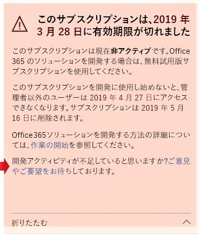

# Office 365 Developer Program FAQ

以下は、Office 365 Developer Program についてよく寄せられる質問です。

## Office 365 Developer Program とは何ですか、対象者は誰ですか?

Office 365開発者プログラムは、Office 365を拡張する、ユーザー中心のクロスプラットフォームの生産性向上エクスペリエンスを構築するのに役立つように設計されています。 Office 365 製品とテクノロジの最適なソリューションを構築するのに必要なツール、ドキュメント、トレーニング、専門家、および コミュニティイベントにアクセスするプログラムに参加します。以下をカバーしています：

- [Excel](https://developer.microsoft.com/excel)、[Outlook](https://developer.microsoft.com/outlook)、[Word](https://developer.microsoft.com/word)、そして[PowerPoint](https://developer.microsoft.com/powerpoint) web add-ins
- [SharePoint](https://developer.microsoft.com/sharepoint)
- [Microsoft Teams](https://developer.microsoft.com/microsoft-teams)
- [Microsoft Graph](https://developer.microsoft.com/graph)

プログラムのメンバーは、Office 365開発者サブスクリプションと25ユーザー ライセンスを無料で得られ、ソリューション作成に役立てることができます。 このサブスクリプションは、ソリューションを積極的に開発および展開している限り、引き続き有効です。

詳しくは、[Office 365 Developer Program に参加する](office-365-developer-program.md)と[Office 365ソリューションを構築する](build-office-365-solutions.md)をご覧ください。
 
## Office 365 開発者サブスクリプションはどのような仕組みなのですか?  

Office 365 開発者プログラムに参加すると、Office 365 開発者サブスクリプション1つを無料で取得できます。 これは、アプリケーション開発専用に設計された特別なサブスクリプションで、25のユーザーライセンスが付属しています。 

Office 365開発者プログラムに参加した後に、Office 365開発者サブスクリプションを受信していろいろ構成することができます。 サブスクリプションは90 日間有効で、有効期間中に開発アクティビティが確認できている限り、90日間延長可能です。 

詳しくは、[Office 365 開発者サブスクリプションのセットアップ](office-365-developer-program-get-started.md)を参照してください。

## 私のサブスクリプションで追加できるライセンスの数はいくつですか?

管理者を含めて最大 25 個のユーザーライセンスを追加することができますが、開発目的のみの使用となります。 アプリケーション開発以外の目的にこのサブスクリプションを使用すると、使用許諾契約違反です。 ライセンスの制限の詳細については以下を参照してください[Office 365 開発サブスクリプション使用条件](terms-and-conditions.md)。

## 1 年間のサブスクリプションをなぜ提供しないのですか？

2019年4月に、開発に積極的に使用している場合は、90日ごとにサブスクリプションを永久的に更新できる新しいモデルに移行しました。 このモデルにより、積極的にソリューションを開発している開発者が、必要な限りサブスクリプションを持てることを担保できるのではないかと考えたのです。 頻繁に開発している場合は、サブスクリプションの有効期限が切れることがありません。 自動的に延長されます。 短期間の開発でサブスクリプションが期限切れになり削除された場合は、新しいサブスクリプションに申し込むことができます。 

あなたがより長い間利用可能であるサブスクリプションを好むならば、Visual Studio ProfessionalまたはVisual Studio Enterpriseのサブスクリプションをお勧めします。 これらのプログラムには、Visual Studio のサブスクリプションが有効なかぎり有効な、無料の Office 365 開発サブスクリプションが含まれます。 このプログラムにアクセスするには[Visual Studio |特典](https://my.visualstudio.com/benefits)を参照してください。 詳しくは [Visual Studio カスタマー サービス](https://www.visualstudio.com/subscriptions/support/)にご連絡ください。 

## サブスクリプションを更新できるかどうかが決定する方法は？

お客様が積極的に開発しているかどうかを判断するために、Office 365開発者プログラムおよびOffice 365開発者サブスクリプションでのアクティビティから得た一連のアルゴリズムと遠隔測定法を使用しています。 定期的にこれらのチェックがなされ、あなたのステータスを更新し、サブスクリプションを延長するべきかどうかを決定します。 

開発アクティビティの正確な追跡が何らかの理由でできていないと考えられる場合は、ダッシュ ボードからお知らせいただくことができます。 開発のためにサブスクリプションをどのように使用しているかを示すフォームを送信するには、ダッシュボードの警告で、**Let us know**リンクを次の図に示すように選択します。 私達はあなたの要求を精査し、延長の資格があるかどうかお知らせします。 

 

## 開発アクティビティを定義する方法とは？

Office 365開発者プログラムおよびOffice 365開発者サブスクリプションでのアクティビティで、お客様が積極的に開発しており、サブスクリプションを更新すべきかどうかを判断しています。 

## どのような開発アクティビティを追跡しているのですか？

追跡する活動の種類の詳細については、以下[Office 365 開発サブスクリプション使用条件](terms-and-conditions.md)を参照してください。 

## Office 365 開発者サブスクリプションにはどんなものが含まれますか?

開発者向けサブスクリプションには、次の項目が含まれます。

- [Exchange Online (プラン 2)](https://products.office.com/exchange/compare-microsoft-exchange-online-plans)
- [Flow for Office 365 Plan 2](https://flow.microsoft.com/pricing/)
- [Microsoft Forms (プラン E5)](https://support.office.com/article/Frequently-asked-questions-about-Microsoft-Forms-495c4242-6102-40a0-add8-df05ed6af61c)
- [Microsoft Planner](https://products.office.com/compare-all-microsoft-office-products?tab=2)
- [Microsoft Stream for O365 E5 SKU](https://products.office.com/business/office-365-enterprise-e5-business-software)
- [Microsoft Teams](https://products.office.com/business/office-365-enterprise-e5-business-software)
- [Office 365 のモバイル デバイス管理](https://support.office.com/article/Set-up-Mobile-Device-Management-MDM-in-Office-365-dd892318-bc44-4eb1-af00-9db5430be3cd)
- [Office 365 ProPlus](https://products.office.com/business/office-365-proplus-business-software)
- [PowerApps for Office 365 プラン 2](https://powerapps.microsoft.com/pricing/)
- [SharePoint Online for Developer](https://products.office.com/SharePoint/compare-sharepoint-plans)
- [Skype for Business Online (プラン 2)](https://products.office.com/skype-for-business/online-meeting-solutions)
- [Sway](https://sway.com/)
- [To-Do (プラン 3)](https://todo.microsoft.com)

## サブスクリプションには Azure へのサブスクリプションも含まれていますか?

このオファーには Azure へのサブスクリプションは含まれていません。 ただし、[無料の Azure アカウントを作成](https://azure.microsoft.com/free/)すると Azure サービスを無料でご利用できます。 

## サブスクリプションはとれほどの期間有効で、いつ期限切れになりますか?

あなたのサブスクリプションは90日間有効であり、有効な開発者の活動が継続する限り更新可能です。 サブスクリプションを開発に使用している場合、無期限で3ヶ月ごとに更新されます。 有効期限は、サブスクリプション名とともに、あなたの [Office 365開発者プログラムダッシュボード](https://developer.microsoft.com/ja-JP/office/profile)で確認できます。 詳細については、[サブスクリプションの有効期限と更新](subscription-expiration-and-renewal.md)を参照してください。

Visual Studio Enterpriseまたは Visual Studio Professional を通じてプログラムに参加する場合、Visual Studio のサブスクリプションの有効期限が切れるまでサブスクリプションが自動的に更新します。 

## サブスクリプションの有効期限が近づいたら延長できますか?

サブスクリプションを延長する唯一の方法は、有効な開発アクティビティをすることです。 カスタム ソリューションを開発するためにサブスクリプションを使用している場合、サブスクリプションは終了し、最終的に削除されます。 

詳細については、[サブスクリプションの有効期限と更新](subscription-expiration-and-renewal.md)を参照してください。

## サブスクリプションの有効期限が切れる場合は、削除までにどの程度の時間的猶予が与えられますか？

サブスクリプションの有効期限終了後、すべてのデータを移行する までに30 日間猶予があります。 有効期限終了後30日間は、管理者だけがサブスクリプションにアクセスでき、60日目にはサブスクリプションとすべてのデータが削除されます。

## Office 365開発者プログラムにサインアップするには、どのアカウントを使用できますか?

次のいずれかの種類のアカウントを使用して、開発者プログラムにサインアップできます。

- **Microsoft アカウント** (個人用に作成されたもの) - Outlook (Hotmail)、Messenger、OneDrive、MSN、Xbox Live、Office 365 など、すべてのコンシューマー向け Microsoft 製品とクラウド サービスにアクセスできます。 Outlook.com メールボックスにサインアップすると、Microsoft アカウントが自動的に作成されます。 作成された Microsoft アカウントを使用して、コンシューマー関連の Microsoft クラウド サービスまたは Azure にアクセスできます。 
- **職場のアカウント** (業務用に管理者が発行したもの) - Azure、Microsoft Intune、Office 365 など、小規模、中規模、エンタープライズ企業レベルの Microsoft クラウド サービスにアクセスできます。 組織としてこのいずれかのサービスにサインアップすると、組織を表すクラウド ベースのディレクトリが Azure Active Directory に自動的にプロビジョニングされます。 詳しくは、[Azure AD ディレクトリの管理](https://docs.microsoft.com/azure/active-directory/active-directory-administer)を参照してください。
- **Visual Studio ID** (Visual Studio Professional またはEnterprise サブスクリプションの作成) - このオプションを使用して、Visual Studio サブスクライバーとしての完全なメリットを活用できる Visual Studio ギャラリー内から開発者プログラムに参加することをお勧めします。 
 
## Microsoft パートナーはサブスクリプションを受け取ることができますか? 

はい。[この手順](office-365-developer-program.md)に従って Office 365 Developer Program に参加し、Office 365 開発者サブスクリプションをセットアップできます。 なお、Visual Studio EnterpriseかVisual Studio Enterprise Professional (MSDN) サブスクリプションを既にお持ちの場合は、特典として Office 365 開発者サブスクリプションが与えられます。 このプログラムにアクセスするには[Visual Studio |特典](https://my.visualstudio.com/benefits)を参照してください。 詳しくは [Visual Studio カスタマー サービス](https://www.visualstudio.com/subscriptions/support/)にご連絡ください。 

## Microsoftのフルタイム従業員の場合は、サブスクリプションを受け取ることができますか？

Microsoft の従業員はこのオファーにサインアップできません。 ただし、Microsoft のすべての社員は、Office E3 Developer へのアクセスを含む無料の Visual Studio (MSDN) サブスクリプションを利用できます。 この特典は [Visual Studio | My Benefits](https://my.visualstudio.com/benefits) から利用できます。

## Microsoft の業務を行うベンダーにはサブスクリプションの資格がありますか?

はい。[この手順](office-365-developer-program.md)に従って Office 365 Developer Program に参加し、Office 365 開発者サブスクリプションをセットアップできます。 ベンダーでさえ、このサブスクリプションは_アプリケーション開発のためだけに_使用できるよう設計されています。 あなたが有効な開発活動をしていない場合、あなたのサブスクリプションは更新されません。

## 私自身の言語でOffice 365開発者プログラムを利用できますか?

英語に加えて、Office 365 開発プログラムは、以下の言語で利用できます: 中国語 (簡体字)、フランス語、ドイツ語、日本語、ポルトガル語 (ブラジル)、ロシア語、スペイン語。

## 私自身の言語でOffice 365開発者サブスクリプションを利用できますか?

Office 365開発者サブスクリプションは英語のみの提供になります。

## サポート

サブスクリプションのセットアップで問題が発生した場合は、下記のサポート資料を参照してください。

- [Stack Overflow](https://stackoverflow.com/questions)   
- [Visual Studio カスタマー サービス](https://www.visualstudio.com/subscriptions/support/)

## 関連項目

- [Office 365 開発者プログラムに参加](office-365-developer-program.md)
- [Office 365 開発者サブスクリプションのセットアップ](office-365-developer-program-get-started.md)
- [サブスクリプションを使用して Office 365 ソリューションを構築します](build-office-365-solutions.md)
- [期限切れのサブスクリプションを更新します。](subscription-expiration-and-renewal.md)

 

 

 

 

 

 
