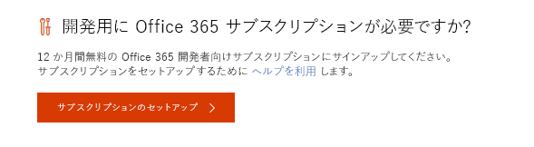
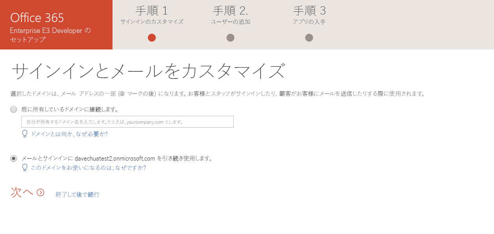

# Microsoft 365 開発者 サブスクリプションを設定する 

運用環境に依存しないソリューションを構築するための Microsoft 365 開発者サブスクリプションを設定します。 サブスクリプションは、25 ユーザー ライセンス付きの Microsoft 365 E5 開発者用のサブスクリプションです。 90日間有効で、開発目的 (コーディングのソリューション) のみに無料で使用できます。 

2019 年 8 月 25 日より前にプログラムに参加したお客様には、Office 365 E3 Developer サブスクリプションがあります。

> [!NOTE] 
> サブスクリプションを設定するには、まず[Office 365 開発者プログラムに参加](office-365-developer-program.md)します。 参加すると、サブスクリプションのセットアップのためのオプションが表示されます。

## サブスクリプションのセットアップ

1. Office 365 開発者向けのサブスクリプションを取得するには、自分のプロファイル ページで、**開発用に Office 365 サブスクリプションが必要ですか?** の下の、**サブスクリプションのセットアップ**を選択します。

  

2. **開発者向けのサブスクリプションをセットアップ**ダイアログ ボックスで、ユーザー名とドメインを作成します。 このアカウントは、サブスクリプションのグローバル管理者の権限を持ちます。 既に使われているものでなければ、任意のユーザー名またはドメイン名を選ぶことができます。 スペースは使用できません。

  

3. パスワードを作成し、確認します。

4. **設定**を選択します。

5. ロボットでないことを証明するよう求められたら、指示に従い**検証**を選択します。

6. サブスクリプションが作成されると、プロファイル ページにサブスクリプションの名前と有効期限が表示されます。

  > [!IMPORTANT]
  > 開発者サブスクリプションにアクセスするときに必要なので、ユーザー名とパスワードをメモします。

## サブスクリプションの設定

1. プロファイル ページで、[office.com](https://www.office.com/) のリンクを選択し、ユーザー ID (例: username@domain.onmicrosoft.com) と、開発者サブスクリプションに指定したパスワードでサインインします。

   > [!NOTE] 
   > サブスクリプションへのサインインには、開発者プログラムの資格情報を使用しないでください。

2. アプリ起動ツールを使用して、[管理センター](https://portal.office.com/adminportal/home#/homepage)へ移動します。

3. 管理センターのホーム ページで、**設定へ移動**を選択します。 そうすると **Office 365 Enterprise E3 開発者向けの設定**ページへ移動します。

4. **サインインとメールをカスタマイズ**。 サブスクリプションをドメインに接続することができます。また、作成した既存のサブドメインも使用できます。 準備ができたら、**次へ**を選択します。

  

5. **新規ユーザーの追加**。 ユーザーを追加できます。 テストするために必要な架空のユーザーでも、開発を支援する実際のユーザーでも構いません。 準備ができたら、**次へ**を選択します。
    
  > [!NOTE]
  > ユーザーを一括で追加する場合は、後で行うことができます。 詳細については、「[Office 365 にユーザーを個別に、またはまとめて追加する - 管理者向けヘルプ](https://support.office.com/article/add-users-individually-or-in-bulk-to-office-365-admin-help-1970f7d6-03b5-442f-b385-5880b9c256ec)」を参照してください。

6. **ライセンスのないユーザーにライセンスを割り当てる**。 すべてのユーザーに関して、サブスクリプションで作業できるようにするには、ライセンスを付与します。 準備ができたら、**次へ**を選択します。

7. **サインインの資格情報を共有**。 サブスクリプションにアクセスする実際のユーザーすべてに、サインインの資格情報をそのユーザーと共有する必要があります。 メール、ダウンロード、または印刷などの方法を選択することができます。 準備ができたら、**次へ**を選択します。

8. **Office アプリのインストール**。 使用しているコンピューターに Office アプリをインストールするオプションがあります。 準備ができたら、**次へ**を選択します。

  

   > [!TIP] 
   > 次回ダッシュ ボードにアクセスするときに、ダッシュ ボードに移動する前に *username@domain*.onmicrosoft.com アカウントでサインインします。

9. **設定が完了しました**。 サブスクリプションの設定が完了しました。 必要に応じて、この操作を評価できます。 準備ができたら、**管理センターに移動**を選択します。
    
   > [!NOTE] 
   > 現時点では、お客様のいる国/地域に関わらず、サブスクリプションの地域は既定で北アメリカに設定されています。 設定に進み、開発者向けのサブスクリプションを使用することもできます。

## Office 365 サービスのプロビジョニング

サブスクリプションの SharePoint や Exchange などのバックエンドサービスのプロビジョニングには、少々時間がかかります。 この手順では、アプリ起動ツールとホーム ページの中の一部のアイコンは**設定中 (このアプリはまだ設定中)** と表示されています。 1 時間もかからないでしょう。

プロビジョニングを完了すると、開発用の新しい Office 365 サブスクリプションを使用することができます。 サブスクリプションの有効期限は90日間です。 延長するには[サブスクリプションの有効期限が切れる前に延長できますか？](office-365-developer-program-faq.md#renew-subscription)を参照してください。

また、リリース オプションを有効にして、できるだけ早く最新の Office 365 の機能へのアクセスできるようにすることをお勧めします。 詳細については、「[Office 365 で標準または対象指定リリース オプションを設定する](https://support.office.com/article/set-up-the-standard-or-targeted-release-options-in-office-365-3b3adfa4-1777-4ff0-b606-fb8732101f47)」を参照してください。

## Microsoft Azure アカウントの設定

一部の Office ソリューションでは、Azure サービスを利用してビルドを行うために Microsoft Azure アカウントが必要になる場合があります。 無料の Azure アカウントを設定するには、「[Azure の無料アカウントを今すぐ作成しましょう](https://azure.microsoft.com/free/)」を参照してください。

## Office 365 開発者プログラムを脱退します

Office 365 の開発者プログラムに参加する必要がなくなった場合は、サブスクリプションを終了し、プログラムを退会できます。

  > [!WARNING]
  > 次の手順により、プロファイル情報がすべて消去されます。 開発者向けサブスクリプションに格納されていて、他の場所にバックアップされていないすべてのデータは失われます。

1. Office 365 開発者プログラムにサインインします。

2. **プロファイルの削除**を選択します。

3. **プロファイルの削除**確認ボックスで、**削除**を選択します。

## 関連項目

- [Office 365 開発者プログラムに参加](office-365-developer-program.md)
- [サブスクリプションを使用して Office 365 ソリューションを構築する](build-office-365-solutions.md)
- [期限切れのサブスクリプションを更新する](subscription-expiration-and-renewal.md)
- [Office 365 開発者プログラム FAQ](office-365-developer-program-faq.md)
