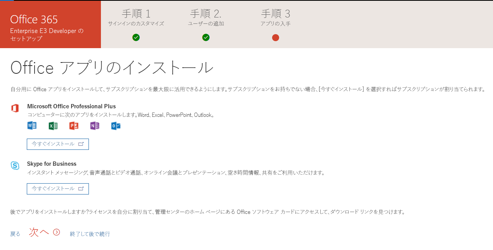

# Microsoft 365 開発者 サブスクリプションを設定するSet up a Microsoft 365 developer subscription 

運用環境に依存しないソリューションを構築するための Microsoft 365 開発者サブスクリプションを設定します。Set up an Office 365 developer subscription to build your solutions independent of your production environment. サブスクリプションは、25 ユーザー ライセンス付きの Microsoft 365 E5 開発者用のサブスクリプションです。The subscription is an Office 365 Enterprise E3 Developer subscription with 25 user licenses. 90日間有効で、開発目的 (コーディングのソリューション) のみに無料で使用できます。It lasts for 90 days and is free to use for development purposes (coding solutions). 

2019 年 8 月 25 日より前にプログラムに参加したお客様には、Office 365 E3 Developer サブスクリプションがあります。Customers who joined the program before August 25th, 2019 have an Office 365 E3 Developer subscription.

> [!NOTE] 
> サブスクリプションを設定するには、まず[Office 365 開発者プログラムに参加](office-365-developer-program.md)します。To set up a subscription, you must first [join the Office 365 Developer Program](office-365-developer-program.md). 参加すると、サブスクリプションのセットアップのためのオプションが表示されます。After joining, you'll see the option to set up a subscription.

## サブスクリプションのセットアップSet up your subscription

1. Office 365 開発者向けのサブスクリプションを取得するには、自分のプロファイル ページで、**開発用に Office 365 サブスクリプションが必要ですか?** の下の、**サブスクリプションのセットアップ**を選択します。To get an Office 365 developer subscription, on your profile page, under **Need an Office 365 subscription to use for development?**, choose **Set up subscription**.

  

2. **開発者向けのサブスクリプションをセットアップ**ダイアログ ボックスで、ユーザー名とドメインを作成します。In the **Set up your developer subscription** dialog box, create a username and domain. このアカウントは、サブスクリプションのグローバル管理者の権限を持ちます。This account will have global administrator permissions for the subscription. 既に使われているものでなければ、任意のユーザー名またはドメイン名を選ぶことができます。You can choose any username or domain name as long as it is not already in use. スペースは使用できません。Do not use spaces.

  

3. パスワードを作成し、確認します。Create and confirm a password.

4. **設定**を選択します。Choose **Set up**.

5. ロボットでないことを証明するよう求められたら、指示に従い**検証**を選択します。If you are asked to prove that you're not a robot, follow the instructions, and then choose **Verify**.

6. サブスクリプションが作成されると、プロファイル ページにサブスクリプションの名前と有効期限が表示されます。After the subscription is created, your subscription name and expiration date appear on your profile page.

  > [!IMPORTANT]
  > 開発者サブスクリプションにアクセスするときに必要なので、ユーザー名とパスワードをメモします。Make a note of your username and password because you'll need it to access your developer subscription.

## サブスクリプションの設定Configure the subscription

1. プロファイル ページで、[office.com](https://www.office.com/) のリンクを選択し、ユーザー ID (例: username@domain.onmicrosoft.com) と、開発者サブスクリプションに指定したパスワードでサインインします。On your profile page, choose the [office.com](https://www.office.com/) link and sign in with your user ID (for example, username@domain.onmicrosoft.com) and the password you specified for your developer subscription.

   > [!NOTE] 
   > サブスクリプションへのサインインには、開発者プログラムの資格情報を使用しないでください。Do not sign in to your subscription with your developer program credentials.

2. アプリ起動ツールを使用して、[管理センター](https://portal.office.com/adminportal/home#/homepage)へ移動します。Use the app launcher to go to the [Admin center](https://portal.office.com/adminportal/home#/homepage).

3. 管理センターのホーム ページで、**設定へ移動**を選択します。On the Admin center home page, choose **Go to setup**. そうすると **Office 365 Enterprise E3 開発者向けの設定**ページへ移動します。This takes you to the **Office 365 Enterprise E3 Developer Setup** page.

4. **サインインとメールをカスタマイズ**。**Personalize your sign-in and email**. サブスクリプションをドメインに接続することができます。また、作成した既存のサブドメインも使用できます。You can connect your subscription to a domain, or just use the existing subdomain that you created. 準備ができたら、**次へ**を選択します。When ready, choose **Next**.

  

5. **新規ユーザーの追加**。**Add new users**. ユーザーを追加できます。You can add users. テストするために必要な架空のユーザーでも、開発を支援する実際のユーザーでも構いません。These could be fictional users, or real users helping you with development. 準備ができたら、**次へ**を選択します。When ready, choose **Next**.
    
  > [!NOTE]
  > ユーザーを一括で追加する場合は、後で行うことができます。If you need to bulk-add users, you can do this later. 詳細については、「[Office 365 にユーザーを個別に、またはまとめて追加する - 管理者向けヘルプ](https://support.office.com/article/add-users-individually-or-in-bulk-to-office-365-admin-help-1970f7d6-03b5-442f-b385-5880b9c256ec)」を参照してください。For more information, see [Add users individually or in bulk to Office 365 - Admin Help](https://support.office.com/article/add-users-individually-or-in-bulk-to-office-365-admin-help-1970f7d6-03b5-442f-b385-5880b9c256ec).

6. **ライセンスのないユーザーにライセンスを割り当てる**。**Assign licenses to unlicensed users**. すべてのユーザーに関して、サブスクリプションで作業できるようにするには、ライセンスを付与します。For any users that you want to be able to work with the subscription, grant them a license. 準備ができたら、**次へ**を選択します。When ready, choose **Next**.

7. **サインインの資格情報を共有**。**Share sign-in credentials**. サブスクリプションにアクセスする実際のユーザーすべてに、サインインの資格情報をそのユーザーと共有する必要があります。For any real users that will access the subscription, you must share their sign-in credentials with them. メール、ダウンロード、または印刷などの方法を選択することができます。You can choose a method, such as email, download, or print. 準備ができたら、**次へ**を選択します。When ready, choose **Next**.

8. **Office アプリのインストール**。**Install your Office apps**. 使用しているコンピューターに Office アプリをインストールするオプションがあります。You have the option of installing Office apps to your computer. 準備ができたら、**次へ**を選択します。When ready, choose **Next**.

  

   > [!TIP] 
   > 次回ダッシュ ボードにアクセスするときに、ダッシュ ボードに移動する前に *username@domain*.onmicrosoft.com アカウントでサインインします。On subsequent visits to the Dashboard, sign in with your *username@domain*.onmicrosoft.com account before you go to the Dashboard.

9. **設定が完了しました**。**You've reached the end of setup**. サブスクリプションの設定が完了しました。You've completed the setup for your subscription. 必要に応じて、この操作を評価できます。You can optionally rate the experience. 準備ができたら、**管理センターに移動**を選択します。When ready, choose **Go to the Admin center**.
    
   > [!NOTE] 
   > 現時点では、お客様のいる国/地域に関わらず、サブスクリプションの地域は既定で北アメリカに設定されています。At this time, the subscription's region defaults to North America regardless of which country/region you are in. 設定に進み、開発者向けのサブスクリプションを使用することもできます。You can still proceed with setting up and using your developer subscription.

## Office 365 サービスのプロビジョニングProvision Office 365 services

サブスクリプションの SharePoint や Exchange などのバックエンドサービスのプロビジョニングには、少々時間がかかります。It will take some time for the backend services, such as SharePoint and Exchange, to provision for the subscription. この手順では、アプリ起動ツールとホーム ページの中の一部のアイコンは**設定中 (このアプリはまだ設定中)** と表示されています。During this step, some of the icons in the app launcher and on the Home page show as **Setting up (This app is still being set up)**. 1 時間もかからないでしょう。This will take no longer than an hour.

プロビジョニングを完了すると、開発用の新しい Office 365 サブスクリプションを使用することができます。When the provisioning is complete, you can use the new Office 365 subscription for development. サブスクリプションの有効期限は90日間です。The subscription expires after 90 days. 延長するには[サブスクリプションの有効期限が切れる前に延長できますか？](office-365-developer-program-faq.md#renew-subscription)を参照してください。To extend it, see [When my subscription is about to expire, can I extend it?](office-365-developer-program-faq.md#renew-subscription).

また、リリース オプションを有効にして、できるだけ早く最新の Office 365 の機能へのアクセスできるようにすることをお勧めします。We also recommend that you enable release options to ensure that you get access to the latest Office 365 features as soon as possible. 詳細については、「[Office 365 で標準または対象指定リリース オプションを設定する](https://support.office.com/article/set-up-the-standard-or-targeted-release-options-in-office-365-3b3adfa4-1777-4ff0-b606-fb8732101f47)」を参照してください。For more information, see [Set up the Standard or Targeted release options in Office 365](https://support.office.com/article/set-up-the-standard-or-targeted-release-options-in-office-365-3b3adfa4-1777-4ff0-b606-fb8732101f47).

## Microsoft Azure アカウントの設定Set up a Microsoft Azure account

一部の Office ソリューションでは、Azure サービスを利用してビルドを行うために Microsoft Azure アカウントが必要になる場合があります。For some Office solutions, you might need a Microsoft Azure account to build using Azure services. 無料の Azure アカウントを設定するには、「[Azure の無料アカウントを今すぐ作成しましょう](https://azure.microsoft.com/free/)」を参照してください。To set up a free Azure account, see [Create your Azure free account today](https://azure.microsoft.com/free/).

## Office 365 開発者プログラムを脱退しますLeave the Office 365 Developer Program

Office 365 の開発者プログラムに参加する必要がなくなった場合は、サブスクリプションを終了し、プログラムを退会できます。If you decide that you no longer want to participate in the Office 365 Developer Program, you can end your subscription and leave the program.

  > [!WARNING]
  > 次の手順により、プロファイル情報がすべて消去されます。The following steps will erase all of your profile information. 開発者向けサブスクリプションに格納されていて、他の場所にバックアップされていないすべてのデータは失われます。You will lose any data stored in your developer subscription that is not backed up elsewhere.

1. Office 365 開発者プログラムにサインインします。Sign in to the Office 365 Developer Program.

2. **プロファイルの削除**を選択します。Choose **Delete Profile**.

3. **プロファイルの削除**確認ボックスで、**削除**を選択します。In the **Delete Profile** confirmation box, choose **Delete**.

## 関連項目See also

- [Office 365 開発者プログラムに参加Join the Office 365 Developer Program](office-365-developer-program.md)
- [サブスクリプションを使用して Office 365 ソリューションを構築するUse your subscription to build Office 365 solutions](build-office-365-solutions.md)
- [期限切れのサブスクリプションを更新するRenew an expiring subscription](subscription-expiration-and-renewal.md)
- [Office 365 開発者プログラム FAQOffice 365 Developer Program FAQ](office-365-developer-program-faq.md)
