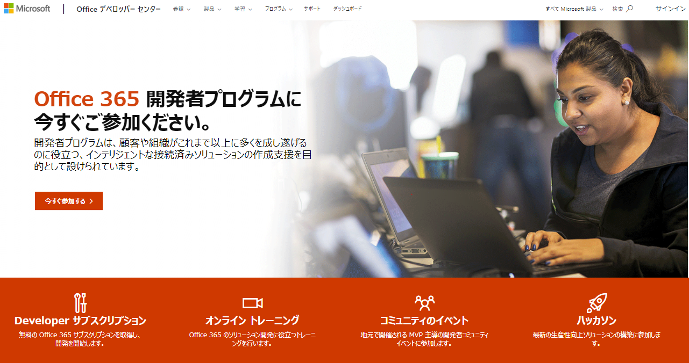
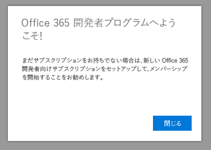

# Office 365 開発者プログラムへようこそWelcome to the Office 365 Developer Program

Office 365 開発プログラムに、友人や同僚と一緒に参加しましょう。Join your friends and colleagues in the Office 365 Developer Program. Office 365 開発者サブスクリプションを使用して、ソリューションをご自分の運用環境で独自に開発やテストを行います。Use the Office 365 developer subscription to develop your solutions independent of your production environment. Microsoft Teams、Office アドイン、Microsoft Graph、SharePoint Framework、SharePoint アドイン、その他さまざまなソリューションを構築することができます。You can build solutions for Microsoft Teams, Office Add-ins, Microsoft Graph, SharePoint Framework, SharePoint Add-ins, and more.

## Office 365 開発者プログラムに参加Join the Office 365 Developer Program

1. [Office 365 開発者プログラムに参加](https://developer.microsoft.com/office/dev-program)のページに移動します。Go to the [Join the Office 365 Developer Program](https://developer.microsoft.com/office/dev-program) page. 

2. 右上隅にある**サインイン**を選択し、Microsoft アカウント、または Azure Active Directory が有効化されたメール アドレスでサインインします。In the upper-right corner, choose **Sign in** to sign in with your Microsoft account or Azure Active Directory-enabled email. 

  

3. サインインした後、**今すぐ参加する**を選択します。After signing in, choose **Join now**.

4. **Office 365 開発プログラム サインアップ**ページで、オンライン フォームの以下のフィールドに入力します。On the **Office 365 Developer Program Signup** page, complete the following fields in the online form:

  - **連絡先のメール アドレス****Contact Email**
  - **国/地域設定****Country/Region**
  - **会社名****Company**

  

5. **条項および条件**を確認します。Review the **terms and conditions**. 参加する前に、チェック ボックスをオンにする必要があります。You'll need to select the check box before you can join.

6. 必要に応じて、**Office 365 開発者プログラムに関する情報、ヒント、および特典を受け取ります。** のチェック ボックスをオンにすると、新しい機能とその他の更新プログラムについて Microsoft から情報を得ることができます。Optionally, select the **I would like to hear from the Office 365 Developer Program** check box if you want to hear from Microsoft about new capabilities and other updates. 

7. **次へ**を選択します。Choose **Next**.

8. **Office 365 開発者プログラムのユーザー設定**ページでユーザー設定を行うと、操作性をカスタマイズすることができます。たとえば、On the **Office 365 Developer Program Preferences** page, tell us your preferences so we can personalize your experience, including:

  - 従事している業界。The industry that you work in.
  - 開発に興味のあるアプリケーションやソリューションの種類。The type of applications or solutions that you're interested in developing.
  - 関心のある製品、テクノロジ、プログラミング言語。Products, technologies, and programming languages that you're interested in.

  

9. 完了したら、**参加**をクリックします。When you're finished, choose **Join**. 次のページの右上にユーザー設定が表示され、"ようこそ" メッセージを受け取ります。Your preferences appear on the next page in the top right, and you receive a Welcome message.

  

## 次のステップNext steps

- [Office 365 開発者サブスクリプションのセットアップ](office-365-developer-program-get-started.md)を行います。[Set up an Office 365 developer subscription](office-365-developer-program-get-started.md). 

- 開発者サブスクリプションを設定した後、[サブスクリプションを使用](build-office-365-solutions.md)して希望するソリューションの種類を設定します。After you have your developer subscription, [use your subscription](build-office-365-solutions.md) to build the types of solutions that you want.

- サブスクリプションの期限切れ情報については、[サブスクリプションの有効期限と更新](subscription-expiration-and-renewal.md)を参照してください。For information about expiring subscriptions, see [Subscription expiration and renewal](subscription-expiration-and-renewal.md).

- Office 365 開発者プログラムに関するよく寄せられる質問は、「[FAQ](office-365-developer-program-faq.md)」を参照してください。For frequently asked questions about the Office 365 Developer Program, see the [FAQ](office-365-developer-program-faq.md).

