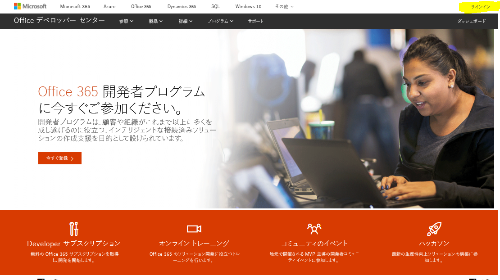
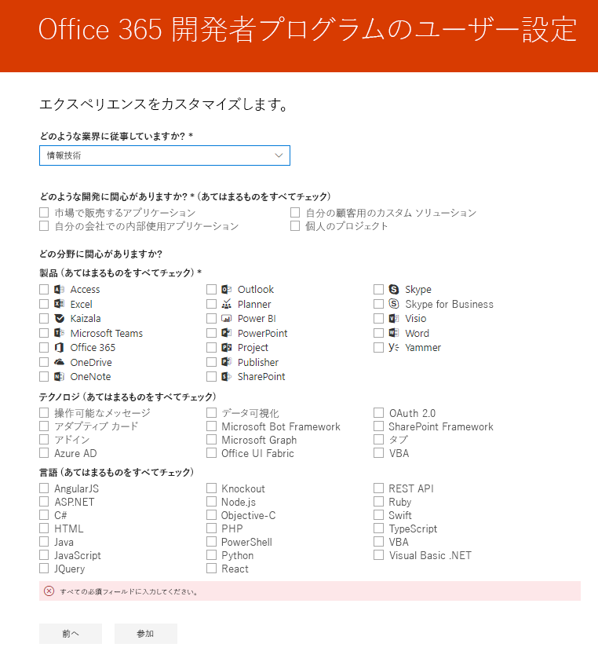

# Office 365 開発者プログラムへようこそ

Office 365 開発プログラムに、友人や同僚と一緒に参加しましょう。 Office 365 開発者サブスクリプションを使用すると、Office 365 のソリューションをお客様の本番環境で独自に開発・テストしていただけます。 Microsoft Teams、Office アドイン、Microsoft Graph、SharePoint Framework、SharePoint アドイン、そのた様々なソリューションを構築することができます。

## Office 365 開発者プログラムに参加

1. [Office 365 開発者プログラムに参加](https://developer.microsoft.com/ja-JP/office/dev-program)のページに移動します。 

2. 右上隅にある**サインイン**を選択し、Microsoft アカウントもしくは Azure Active Directory が有効化されたメールアドレスでサインインします。 

  

3. サインインした後、**今すぐ参加**を選択します。

4. **Office 365 開発プログラム サインアップ**ページで、以下のオンライン フォームのフィールドに入力します。

  - **連絡先のメールアドレス**
  - **国/地域名**
  - **会社**

  

5. **使用条件**を確認します。 参加する前に、チェック ボックスをオンにする必要があります。

6. 必要に応じて、**Office 365 開発プログラムから情報を得る**のチェック ボックスをオンにすると、新しい機能とその他の更新プログラムについて Microsoft から情報を得ることができます。 

7. **次へ** を選択します。

8. **Office 365 開発プログラム設定**ページでユーザー設定を行うと、操作性をカスタマイズすることができます。例えば、

  - お客様の業界に応じてカスタマイズすることができます。
  - また、お客様が開発してみたいアプリケーションやソリューション。
  - 製品、テクノロジー、および興味のあるプログラミング言語によってカスタマイズが可能です。

  

9. 完了したら、**参加**をクリックします。 次のページの右上でユーザー設定が表示され、”ようこそ”メッセージを受け取ります。

  

## 次のステップ

- [Office 365 開発者サブスクリプションの設定](office-365-developer-program-get-started.md)をします。 

- 開発者サブスクリプションを設定した後、[サブスクリプションを使用](build-office-365-solutions.md)して希望するソリューションの種類を設定します。

- Office 365 Developer Program に関してよく寄せられる質問は、[FAQ](office-365-developer-program-faq.md)をご覧ください。 
