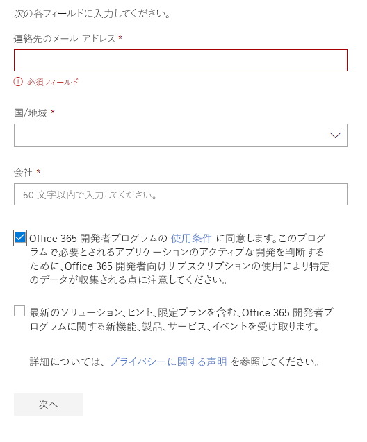

# Office 365 開発者プログラムへようこそ

Office 365 開発プログラムに、友人や同僚と一緒に参加しましょう。 Office 365 開発者サブスクリプションを使用して、ソリューションをご自分の運用環境で独自に開発やテストを行います。 Microsoft Teams、Office アドイン、Microsoft Graph、SharePoint Framework、SharePoint アドイン、その他さまざまなソリューションを構築することができます。

## Office 365 開発者プログラムに参加

1. [Office 365 開発者プログラムに参加](https://developer.microsoft.com/office/dev-program)のページに移動します。 

2. 右上隅にある**サインイン**を選択し、Microsoft アカウント、または Azure Active Directory が有効化されたメール アドレスでサインインします。 

  

3. サインインした後、**今すぐ参加する**を選択します。

4. **Office 365 開発プログラム サインアップ**ページで、オンライン フォームの以下のフィールドに入力します。

  - **連絡先のメール アドレス**
  - **国/地域設定**
  - **会社名**

  

5. **条項および条件**を確認します。 参加する前に、チェック ボックスをオンにする必要があります。

6. 必要に応じて、**Office 365 開発者プログラムに関する情報、ヒント、および特典を受け取ります。** のチェック ボックスをオンにすると、新しい機能とその他の更新プログラムについて Microsoft から情報を得ることができます。 

7. **次へ**を選択します。

8. **Office 365 開発者プログラムのユーザー設定**ページでユーザー設定を行うと、操作性をカスタマイズすることができます。たとえば、

  - 従事している業界。
  - 開発に興味のあるアプリケーションやソリューションの種類。
  - 関心のある製品、テクノロジ、プログラミング言語。

  

9. 完了したら、**参加**をクリックします。 次のページの右上にユーザー設定が表示され、"ようこそ" メッセージを受け取ります。

  

## 次のステップ

- [Office 365 開発者サブスクリプションのセットアップ](office-365-developer-program-get-started.md)を行います。 

- 開発者サブスクリプションを設定した後、[サブスクリプションを使用](build-office-365-solutions.md)して希望するソリューションの種類を設定します。

- サブスクリプションの期限切れ情報については、[サブスクリプションの有効期限と更新](subscription-expiration-and-renewal.md)を参照してください。

- Office 365 開発者プログラムに関するよく寄せられる質問は、「[FAQ](office-365-developer-program-faq.md)」を参照してください。

