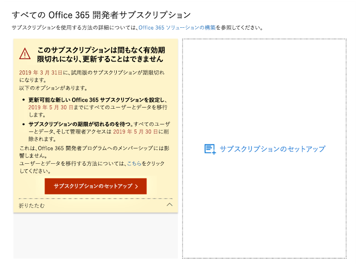
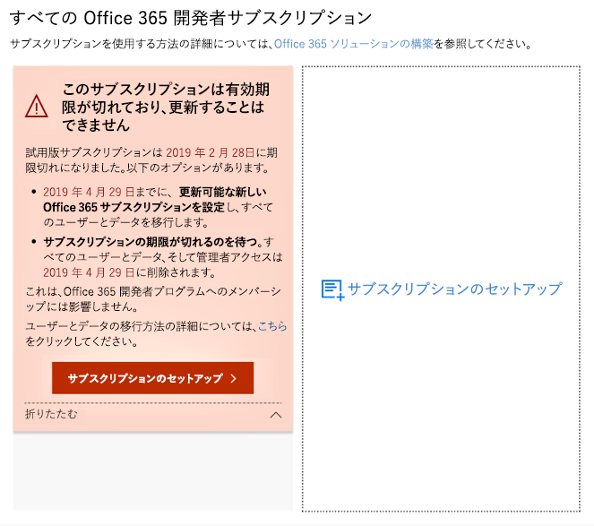
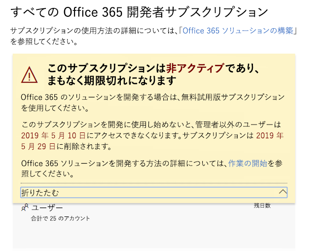
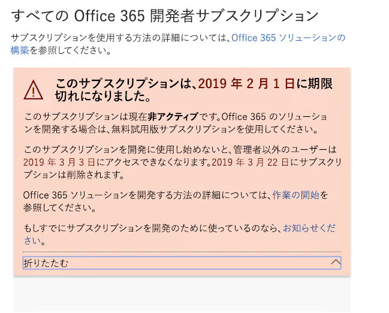
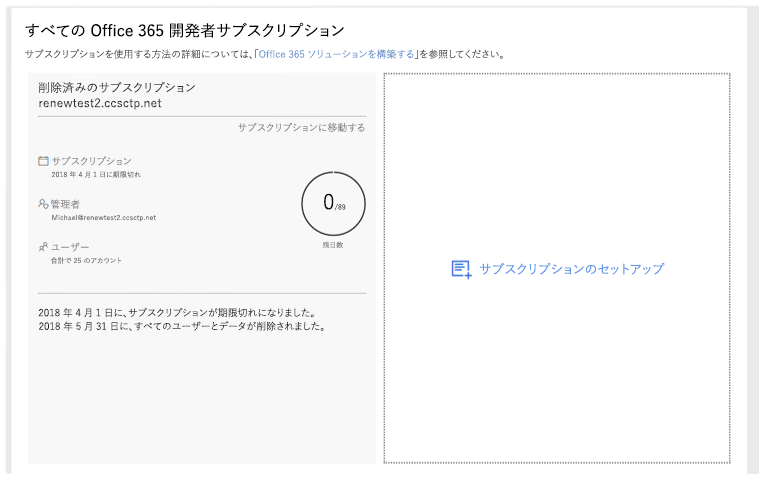

# Office 365 開発者プログラム サブスクリプションの有効期限と更新

Office 365 開発者プログラムのメンバーシップには、無料の Office 365 開発者サブスクリプションが含まれています。 開発者サブスクリプションは開発アクティビティに基づいて更新可能です。ただし、一部の古いサブスクリプションは期限切れになります。 この記事では、更新可能なサブスクリプションと更新できないサブスクリプションの違い、および有効期限が切れた場合のサブスクリプションのアップグレード方法について説明します。

## 期限切れ vs. 更新可能 開発者サブスクリプション

Office 365 開発者プログラムのリリースに伴い、期限切れになると更新できない12 か月間の開発者サブスクリプションが提供されました。 2018 年 1 月、一部の開発者プログラム メンバーに対して、更新可能なサブスクリプションの提供を開始しました。

2019年 4 月から、更新可能な 90 日間のサブスクリプションを提供しています。

[Office 365 開発者プログラム ダッシュボード](https://developer.microsoft.com/ja-JP/office/profile)を表示すると、更新可能なサブスクリプションがあるかどうかを確認できます。

## 更新できないサブスクリプション

2018年 8 月より前にサブスクリプションにサインアップした場合、サブスクリプションは更新できず、ダッシュボードに次の警告が表示されます。 現在のサブスクリプションの有効期限が切れる前に、サブスクリプションを置換する必要があります。 警告テキストには、サブスクリプションを更新できないことが示されます。 また、サブスクリプションの有効期限が切れることを通知するメールも送信されます。
 
 

サブスクリプションの期限が切れると、次の警告テキストが表示されます。

 

代替サブスクリプションを作成するには、**サブスクリプションの設定**を選択します。 

また、新しいサブスクリプションに保存する必要がある重要なデータを移行する必要があります。 詳細については、「[データを移行する方法](#migrate-data)」のトピックの後半で説明します。

## 更新可能なサブスクリプション

2018 年 8 月以降にサブスクリプションにサインアップした場合、更新可能なサブスクリプションを取得している可能性があります。 サブスクリプションがアクティブでない場合、ダッシュ ボードに次の警告が表示されます。 

 

サブスクリプションの期限が切れると、次の警告テキストが表示されます。

 

あなたがアクティブな開発者であれば、サブスクリプションは次の 90 日間分自動的に更新されます。 

## 現在のサブスクリプションを更新できないのはなぜですか。

2018 年 8 月に更新可能なサブスクリプションを導入しました。 それより前にサブスクリプションにサインアップした場合、サブスクリプションは更新できず、期限が切れると新しいものを設定する必要があります。

## サブスクリプションの有効期限が切れたときにデータを移行する方法は?

現在のサブスクリプションから新しいサブスクリプションにデータを移行するには、次のリソースを参照してください。

- [1 つの Office 365 テナントから別のテナントにメールボックスを移行する方法](https://docs.microsoft.com/exchange/mailbox-migration/migrate-mailboxes-across-tenants)
- [PowerShell を使用して Office 365 への段階的な移行を実行する](https://docs.microsoft.com/office365/enterprise/powershell/use-powershell-to-perform-a-staged-migration-to-office-365)
- [サード パーティを介さずに別の Office 365 サブスクリプションに移行する](https://social.technet.microsoft.com/Forums/en-US/ee507441-eb91-4b0a-ba6c-5bd9bb8c71b1/migration-from-one-o365-tenant-to-another-o365-without-third-party?forum=onlineservicesmigrationandcoexistence)

## 自分のサブスクリプションが削除されたかどうか、どうすれば確認できますか。

サブスクリプションが削除されると、次のスクリーンショットに示すように、サブスクリプションとその ID が削除されたという通知がダッシュボードに表示されます。 

 

## 関連項目

- [Office 365 Developer Program に参加する](office-365-developer-program.md)
- [Office 365 開発者サブスクリプションのセットアップ](office-365-developer-program-get-started.md)
- [サブスクリプションを使用して Office 365 ソリューションを構築する](build-office-365-solutions.md)
- [Office 365 開発者プログラム FAQ](office-365-developer-program-faq.md)

